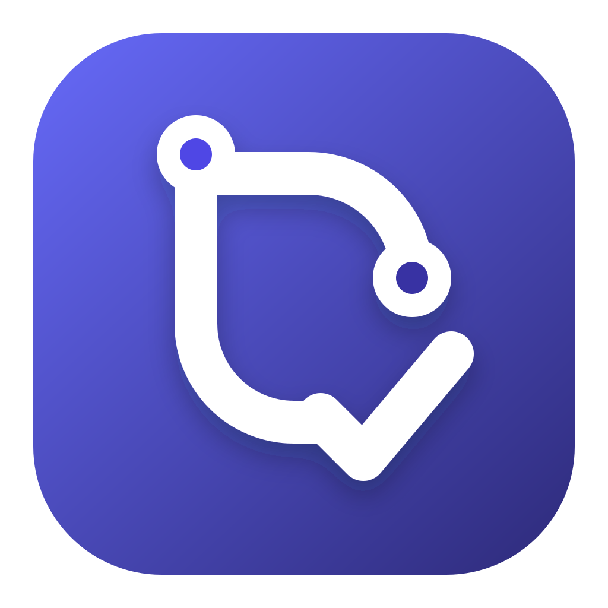
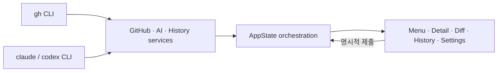

# PR Review Reminder

[](https://github.com/90ms/pr-review-reminder/actions/workflows/ci.yml)
[](https://github.com/90ms/pr-review-reminder/releases/latest)
[](LICENSE)



리뷰 요청을 놓치지 않고, AI가 만든 리뷰 초안을 직접 확인한 뒤 게시하는 macOS 메뉴바
앱입니다. GitHub 작업은 `gh` CLI에, 분석은 `claude` 또는 `codex` CLI에 위임하므로
앱이 토큰이나 API 키를 저장하지 않습니다.

- 리뷰 요청된 열린 PR을 수집하고 일정에 따라 다시 확인합니다.
- PR 요약, 리뷰 포인트와 인라인 코멘트 초안을 생성합니다.
- Split/Unified diff에서 초안을 편집한 뒤 명시적으로 게시합니다.
- 동일한 head commit의 결과를 복원해 불필요한 토큰 소비를 줄입니다.
- 리뷰 히스토리, 사용량·비용 추정과 로컬 토큰 예산을 제공합니다.

> AI 결과는 초안입니다. 앱은 코멘트, 승인 또는 이슈를 자동으로 게시하지 않으며,
> 항상 사용자의 미리보기와 명시적인 제출 동작을 요구합니다.

## 설치

### 요구 사항

- macOS 14 Sonoma 이상
- Xcode 16.4 이상 — Homebrew가 앱을 로컬에서 소스 빌드할 때 사용
- [`gh`](https://cli.github.com) CLI 로그인. 피드백 이슈 제출에서 라벨을 붙이려면
  이슈 쓰기 권한과 라벨 쓰기 권한이 필요합니다.
- `claude` 또는 `codex` CLI 중 하나 이상과 해당 CLI 로그인

```bash
gh auth login
gh auth status
```

### Homebrew

Developer ID 없이 배포하므로 공개
[`90ms/homebrew-tap`](https://github.com/90ms/homebrew-tap)에서 소스를 받아 사용자의
Mac에서 빌드합니다.

Homebrew 6 이상에서는 비공식 tap의 코드를 실행하기 전에 신뢰 범위를 확인합니다.
전체 tap 대신 이 Formula 하나만 신뢰하도록 정규화된 이름으로 설치하는 방식을
권장합니다.

```bash
brew install 90ms/tap/pr-review-reminder
pr-review-reminder --install-app
pr-review-reminder
```

이미 `brew tap 90ms/tap`을 실행했고 신뢰 오류가 발생했다면:

```bash
brew trust --formula 90ms/tap/pr-review-reminder
brew install pr-review-reminder
```

`--install-app`은 Homebrew Cellar의 앱을 `~/Applications/PR Review Reminder.app`에서
열 수 있도록 안전한 symlink를 만듭니다. 기존 실제 앱이나 다른 대상을 가리키는
symlink는 덮어쓰지 않습니다.

### 업데이트와 제거

```bash
# 업데이트
brew update
brew upgrade pr-review-reminder

# 제거
pr-review-reminder --uninstall-app
brew uninstall pr-review-reminder
```

제거해도 사용자 설정과 히스토리는 자동으로 삭제하지 않습니다.
Homebrew 설치본은 앱의 **설정 → 일반 → 업데이트**에서도 최신 Formula를 확인하고 설치할 수
있습니다. tap 갱신, 버전 조회, 빌드·설치와 링크 갱신 상태를 구분해 표시하며 진행
중인 작업을 취소할 수 있습니다. 설치가 완료되면 새 버전을 실행하고 기존 앱을
자동으로 종료합니다. 재실행에 실패한 경우 **지금 다시 시작** 버튼으로 다시 시도할
수 있습니다.

## 첫 실행

설치 상태와 필수 CLI 탐지를 먼저 확인할 수 있습니다.

```bash
pr-review-reminder --doctor
```

진단이 통과하면 `pr-review-reminder`를 실행합니다. 메뉴바 오른쪽의 체크리스트
아이콘을 누르고 설정 탭에서 다음 항목을 확인하세요.

1. 리뷰를 찾을 GitHub owner/org와 선택적 repository 목록
2. 사용할 AI 도구(`claude` 또는 `codex`)와 리뷰 출력 언어
3. 직접 작성하거나 파일에서 불러온 리뷰 가이드라인
4. 저장소에서 탐색·분류해 임포트한 프로젝트 가이드라인
5. 자동화 탭의 매일/주기별 스케줄과 자동 리뷰
6. 일반 탭의 알림, 로그인 시 실행과 업데이트
7. 데이터 탭의 히스토리 보존 기간과 로컬 저장소 상태

## 사용 흐름

1. **새로고침**으로 리뷰 대기 PR과 내 PR에 도착한 미승인 리뷰 피드백을 수집합니다.
   이 단계는 AI 리뷰를 실행하거나 GitHub에 쓰지 않습니다.
2. PR 카드에서 **코드 리뷰**를 눌러 AI 초안을 생성합니다. 직접 작성한 지침,
   선택한 가이드라인 파일과 저장소에서 임포트한 프로젝트 문서는 하나의 리뷰
   컨텍스트로 조합됩니다.
   완료된 PR은 **리뷰 다시하기**로 현재 head와 diff를 다시 가져와 새 초안을 만들 수 있습니다.
3. **자세히 보기**에서 `리뷰 / 변경 내용 / 나란히` 레이아웃을 선택하고 요약,
   리뷰 포인트, Split/Unified diff와 인라인 코멘트를 검토·편집합니다.
4. 제출 미리보기에서 인라인 코멘트를 다시 편집하거나 삭제한 뒤 코멘트만 남기거나
   코멘트와 함께 승인할지 선택합니다. 남길 코멘트나 리뷰 포인트가 없으면
   **문제 없음 · 승인**으로 기본 승인 문구를 확인한 뒤 승인할 수 있습니다.
5. **히스토리**에서 과거 상세/diff를 열거나 현재 head를 가져와 다시 리뷰합니다.

## 주요 기능

| 영역 | 내용 |
|---|---|
| PR 수집 | `review-requested:@me` 리뷰 요청 인박스와 `author:@me` 미승인 피드백 인박스, owner/repository 범위 설정, 최대 1,000건 검색 |
| 조회 진단 | GitHub 재시도 횟수, rate limit 실패와 1,000건 검색 상한 표시 |
| AI 리뷰 | Claude/Codex CLI, 직접 지침·가이드라인 파일·저장소 문서 조합, 완료 결과 다시 리뷰, 10분 timeout과 취소 |
| 저장소 가이드라인 | 기본 브랜치의 `AGENTS.md`, `CLAUDE.md`, 리뷰 스킬, 컨벤션·아키텍처 Markdown 후보 탐색과 선택 AI 분류 |
| 상세·Diff | 리뷰/변경/나란히 집중 보기, 파일 검색·변경 줄·인라인 코멘트 위치 이동, 긴 줄 가로 스크롤 |
| 게시 안전 | 코멘트 없는 승인, 미리보기, 게시 직전 head SHA 재확인, 단일 GitHub review 제출 |
| 히스토리 | 상세/diff 저장, 같은 head 결과 복원, 보존 기간과 전체 삭제 |
| 사용량 | Claude 보고 비용, Codex 설정 단가 기반 추정, 기간별 로컬 토큰 예산 |
| 자동화 | 매일 또는 N시간 간격 수집, 최근 실행 결과 보존, 실패 알림, 로그인 시 실행, 선택적 자동 분석 |
| 업데이트 | 단계별 진행·실패 표시, 취소, Applications 링크 갱신과 앱 재시작 |
| 언어 | 앱 UI와 리뷰 출력 언어를 독립적으로 설정 |
| 피드백 | 내용을 AI로 정돈하고 사용자 확인 후 이 프로젝트의 GitHub 이슈로 등록, `codex-ready`와 분류 라벨 지정, 등록한 이슈 상태 추적 |
| 충돌 복구 | 다음 실행에서 비정상 종료를 감지하고 진단 이슈 초안을 사용자 확인 후 등록 |

## 데이터와 보안

- 인증 정보는 저장하지 않고 설치된 CLI의 인증 세션을 사용합니다.
- AI 리뷰를 실행하면 선택한 PR의 제목, 본문, diff와 설정한 리뷰 지침이 선택한
  `claude` 또는 `codex` CLI를 통해 해당 서비스 제공자에게 전달됩니다. 앱은 AI CLI를
  빈 임시 작업 디렉터리, 최소 환경 변수, 쓰기 제한과 10분 제한시간으로 실행하지만,
  계정·보존·학습 정책은 사용 중인 CLI와 서비스 제공자의 정책을 따릅니다.
- **저장소에서 찾아보기**를 실행하면 `gh`가 기본 브랜치의 Markdown 후보를 읽고,
  제한된 본문 발췌를 선택한 AI CLI에 전달해 리뷰·컨벤션·아키텍처 관련성을
  분류합니다. 임포트된 원문, 저장소, 경로와 revision은 앱 설정에 저장됩니다.
- 히스토리를 켜면 PR 본문, diff, AI 결과와 사용량을
  `~/Library/Application Support/PRReviewReminder/history.json`에 저장합니다.
- 등록한 피드백 이슈의 제목·본문·URL·상태는 `UserDefaults`에, 내 PR 피드백의 마지막
  확인 review ID는 Application Support의 `feedback-seen.json`에 저장합니다.
- 히스토리 저장을 끄거나 보존 기간을 설정하고 앱에서 전체 삭제할 수 있습니다.
- 설정의 **로컬 저장소**에서 설정·히스토리 위치, 크기, 마지막 저장 시각과 오류를
  확인할 수 있습니다. 손상된 히스토리 JSON은 별도 파일로 백업한 뒤 안전하게 복구합니다.
- GitHub 게시 명령은 일반 오류에서 자동 재시도하지 않습니다. 피드백 이슈 라벨이
  없거나 적용할 수 없는 경우에만 라벨 없이 한 번 생성하고, 누락 라벨을 화면에
  경고합니다. PR에는 사용자가 최종 미리보기에서 제출한 인라인 코멘트 목록만
  등록합니다.
- 비정상 종료 표식에는 PID, 앱 버전, 시작 시각만 저장합니다. 다음 실행에서 만드는
  진단 초안도 앱·OS 메타데이터만 포함하며 사용자가 내용을 확인하고 제출해야 합니다.
- Formula는 HTTPS 태그 소스와 고정 SHA-256을 사용하고 tap CI에서 소스 설치,
  `brew test`, strict audit를 검증합니다.

## 문제 해결

### `untrusted tap` 오류

Homebrew 6의 공급망 보호 기능입니다. 필요한 Formula만 신뢰한 뒤 다시 설치하세요.

```bash
brew trust --formula 90ms/tap/pr-review-reminder
brew install pr-review-reminder
```

전체 tap을 신뢰하는 `brew trust 90ms/tap`도 가능하지만 현재와 미래의 모든 Formula를
신뢰하므로 권장 범위보다 넓습니다. 자세한 내용은
[Homebrew Tap Trust](https://docs.brew.sh/Tap-Trust)를 참고하세요.

### 앱에서 `gh`, `claude`, `codex`를 찾지 못함

터미널과 GUI 앱의 `PATH`가 다를 수 있습니다. 진단 결과와 실제 설치 위치를 확인하세요.

```bash
pr-review-reminder --doctor
command -v gh
command -v claude
command -v codex
```

앱은 로그인 셸과 잘 알려진 Homebrew/npm 설치 경로를 함께 탐색합니다.

### 앱은 열려 있지만 창이 보이지 않음

이 앱은 Dock 대신 메뉴바에서 동작합니다. 메뉴바 오른쪽의 체크리스트 아이콘을
확인하세요.

## 소스에서 개발

```bash
git clone https://github.com/90ms/pr-review-reminder.git
cd pr-review-reminder

swift build
swift test
./Scripts/build-app.sh
open "dist/PR Review Reminder.app"
```

패키징 출력과 버전은 환경 변수로 주입할 수 있습니다.

```bash
OUTPUT_DIR=/tmp/prr-package APP_VERSION=0.5.1 BUILD_NUMBER=51 \
  ./Scripts/build-app.sh
```

## PR 통합 검증

여러 Draft PR의 병합 순서, 교차 충돌, 통합 테스트와 릴리스 준비 상태는 저장소의
`$validate-github-prs` 스킬로 읽기 전용 검증할 수 있습니다. 이 스킬은 임시
worktree에서 정확한 PR SHA들을 함께 합쳐 보지만 GitHub review·approval·comment,
push 또는 merge는 게시하지 않습니다.

## 아키텍처



핵심 로직은 `PRRCore`에 있고 실행 대상은 얇은 macOS 앱 진입점으로 유지합니다.

```text
Sources/
  PRRCore/
    Models/          데이터 모델
    Services/        GitHub, AI, 히스토리, 설정, 스케줄
    ViewModels/      AppState 오케스트레이션
    Views/           메뉴, 상세, diff, 히스토리, 설정
    Support/         프로세스 실행, CLI 탐지, 로컬라이징
  PRReviewReminder/  @main 앱 진입점과 --doctor
Tests/               단위·오케스트레이션·스크립트 테스트
Scripts/             앱 패키징, launcher, Formula renderer
.agents/skills/      릴리스·이슈 구현·다중 PR 검증 Codex workflow
```

## 알려진 제약

- 내가 리뷰어로 요청된 PR과 내가 작성한 PR의 미승인 리뷰 피드백을 별도 인박스로
  표시합니다. 피드백 인박스는 정식 PR review와 GitHub `reviewDecision`을 기준으로
  합니다.
- 스케줄은 앱이 실행 중일 때만 동작하며 별도 background daemon은 없습니다.
- 한 GitHub Search 쿼리는 API 제한에 따라 최대 1,000건을 조회합니다.
- Codex 비용은 실제 청구액이 아니라 설정한 모델 단가와 보고 토큰을 이용한 추정입니다.
- 로컬 토큰 예산은 CLI 계정의 실제 잔여량이 아니라 저장된 히스토리 기반 근사입니다.
- Developer ID가 없어 GitHub Release ZIP은 ad-hoc 서명됩니다. 일반 설치에는 로컬에서
  빌드하는 Homebrew Formula를 권장합니다.

## 문서

- [GitHub Wiki](https://github.com/90ms/pr-review-reminder/wiki)
- [Wiki 홈 원본](docs/WIKI_HOME.md)
- [제품 소개와 흐름](docs/PROJECT_OVERVIEW.md)
- [현재 제품 명세](docs/SPEC.md)
- [Homebrew 배포 가이드](docs/HOMEBREW.md)
- [릴리스 가이드](docs/RELEASING.md)
- [macOS 수동 검증 체크리스트](docs/MACOS_VALIDATION.md)
- [실행 계획](tasks/plan.md)
- [변경 기록](CHANGELOG.md)

이 프로젝트는 MIT License로 배포됩니다.
