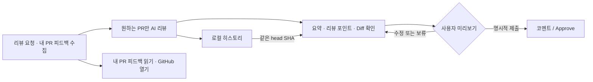

# PR Review Reminder

## 리뷰 요청을 놓치지 않고, 게시 전에는 반드시 사람이 확인합니다

PR Review Reminder는 macOS 메뉴바에서 내가 리뷰어로 요청된 Pull Request와 내가
작성한 PR에 도착한 미승인 리뷰 피드백을 분리해 보여주는 로컬 앱입니다. 필요할 때만
`claude` 또는 `codex` CLI로 리뷰 초안을 만들고, 요약·리뷰 포인트·diff·인라인
코멘트를 확인한 뒤 사용자가 선택한 내용만 GitHub에 게시합니다.

### 한눈에 보는 흐름

### 왜 이 앱인가요?

- **메뉴바에서 바로 확인** — 여러 저장소의 리뷰 대기 PR을 한곳에 모읍니다.
- **내 PR 피드백 인박스** — 변경 요청, 코멘트, 승인 대기를 별도로 확인하고 같은
  review 알림을 중복 발송하지 않습니다.
- **온디맨드 AI 리뷰** — 수집과 AI 분석을 분리해 불필요한 사용량을 줄입니다.
- **코드와 함께 검토** — 큰 상세 창에서 Split/Unified diff와 초안을 함께 봅니다.
- **빠른 변경 탐색** — 파일을 검색하고 변경 줄 또는 인라인 코멘트 위치로 이동합니다.
- **사람이 마지막 결정** — 코멘트, 승인, 피드백 이슈는 자동 게시하지 않습니다.
- **같은 커밋은 재사용** — PR/head SHA별 히스토리에서 결과와 사용량을 복원하고,
  상세 diff를 열거나 현재 head를 재리뷰합니다.
- **멈추지 않는 작업 제어** — AI CLI timeout과 사용자 취소를 지원합니다.
- **큰 리뷰 큐 대응** — 최대 1,000개 검색과 제한된 병렬 캐시 조회를 사용합니다.
- **기존 구독 활용** — 앱이 API 키를 받지 않고 로컬 `gh`, `claude`, `codex`
  로그인 상태를 사용합니다.

### 구성

| 필요한 도구 | 역할 |
|---|---|
| macOS 14+ | 메뉴바 앱 실행 |
| `gh` CLI | PR 수집, 상세 조회, 사용자가 승인한 게시 |
| `claude` 또는 `codex` CLI | 로컬 로그인/구독으로 리뷰 초안 생성 |

앱 언어와 리뷰 출력 언어를 따로 선택할 수 있고, 팀의 리뷰 가이드라인을 프롬프트에
추가할 수 있습니다. 매일 지정 시각 또는 일정 간격으로 수집하며 최근 실행 성공·실패를
보존합니다. 신규 PR, 내 PR의 새 리뷰 피드백, 리뷰 완료, 예약 조회 실패를 알림으로
받을 수 있고 로그인 시 자동 실행을 선택할 수 있습니다.

### 프라이버시와 안전 경계

앱은 GitHub 토큰이나 AI API 키를 저장하지 않습니다. 리뷰 결과 캐시에는 PR 본문과
diff가 포함되며 Application Support의 사용자 전용 로컬 JSON에 저장됩니다. 저장
여부와 보존 기간을 설정하고 전체 삭제할 수 있습니다.

AI가 만든 내용은 초안입니다. 코드와 라인 위치를 검증하고 미리보기에서 편집한 뒤
게시하세요. 앱의 핵심 계약은 “자동 수집·선택적 분석·수동 게시”입니다.

배포는 Homebrew source build를 우선하며 태그에는 ad-hoc ZIP과 checksum을 제공할 수
있습니다. Developer ID를 설정한 경우 같은 workflow가 서명과 Apple 공증을 추가합니다.

리뷰 요청 인박스는 `review-requested:@me`, 내 PR 피드백 인박스는 `author:@me`를
후보로 사용합니다. 피드백 인박스는 정식 PR review가 있고 GitHub의 현재
`reviewDecision`이 `APPROVED`가 아닌 열린 PR만 읽기 전용으로 표시합니다.

### 유지보수자용 이슈 자동화

앱 제품과 분리된 선택적 Synology 워커는 새 GitHub 이슈의 라벨·제목·설명 요약을
Slack에 한 번 알린다. `codex-ready` 이슈는 허용된 사용자가 버튼으로 승인한 경우에만
NAS의 Codex CLI로 작업해 Draft PR을 만든다. 자동 병합이나 GitHub review는 수행하지
않으며, 공개 이슈 입력과 로컬 Codex 인증을 함께 사용하는 위험 때문에
격리·보호 경로·dry-run을 기본 운영 경계로 둔다.

생성된 Draft PR들은 저장소의 `$validate-github-prs` 스킬로 함께 검증할 수 있다.
스킬은 정확한 PR SHA를 임시 worktree에서 순서별로 합치고 개별·통합 테스트와 릴리스
준비 상태를 보고하지만 GitHub 상태를 변경하거나 approval·merge를 게시하지 않는다.

### 더 알아보기

- [제품 명세와 아키텍처](SPEC.md)
- [Synology 이슈 자동화 설정](SYNOLOGY_AUTOMATION.md)
- [PR 통합 검증 스킬](../.agents/skills/validate-github-prs/SKILL.md)
- [개선 로드맵](../tasks/plan.md)
- [빌드·실행과 설정](../README.md)
