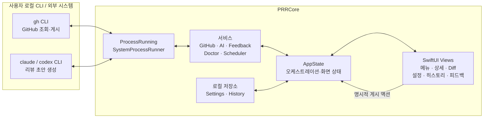

# PR Review Reminder — 제품 명세

> macOS 메뉴바에서 리뷰 요청을 모으고, 사용자의 로컬 `claude` 또는 `codex`
> CLI로 리뷰 초안을 만든 뒤, 사용자가 확인한 내용만 GitHub에 게시한다.

- 기준일: 2026-07-26
- 대상 플랫폼: macOS 14+
- 문서 성격: 현재 구현의 계약. 향후 작업은 [`tasks/plan.md`](../tasks/plan.md)에 둔다.

## 1. 문제와 목표

리뷰 요청이 여러 저장소에 흩어지면 놓치기 쉽고, PR의 의도와 diff를 파악하는 데
반복 비용이 든다. 이 앱은 다음 결과를 목표로 한다.

1. 내가 리뷰어로 요청된 열린 PR을 한곳에서 확인한다.
2. 필요한 PR만 AI로 분석해 요약, 리뷰 포인트, 인라인 코멘트 초안을 얻는다.
3. 큰 상세 화면에서 diff와 초안을 검토하고 편집한다.
4. 미리보기 후 사용자가 명시적으로 선택한 코멘트 또는 승인만 게시한다.
5. 같은 PR head commit의 결과는 로컬 히스토리에서 복원해 AI 사용량을 줄인다.

## 2. 핵심 원칙

- **게시 권한은 사용자에게 있다.** 자동 수집·분석은 가능하지만 코멘트, 승인,
  피드백 이슈 게시는 반드시 사용자의 명시적 액션으로 시작한다.
- **인증 정보를 소유하지 않는다.** GitHub 인증은 `gh`, AI 인증과 과금은
  `claude`/`codex` CLI에 위임하며 앱은 토큰이나 API 키를 저장하지 않는다.
- **외부 명령을 테스트 경계로 둔다.** 모든 CLI 실행은 `ProcessRunning`을 통해
  주입되어, 테스트가 실제 GitHub 게시나 AI 호출을 수행하지 않게 한다.
- **로컬 데이터의 범위를 드러낸다.** 리뷰 결과와 diff를 포함한 히스토리는
  Application Support 아래 로컬 JSON에 저장된다.

## 3. 사용자 흐름

### 3.1 최초 준비

사용자는 `gh` 로그인과 사용할 AI CLI 로그인을 미리 완료한다. 앱은 시작 시
`gh`, `claude`, `codex` 설치 및 인증 상태를 진단한다. 설정에서 GitHub owner,
선택 저장소, AI 도구, 언어, 스케줄, 알림, 프롬프트와 리뷰 가이드라인을 지정한다.

### 3.2 수집과 분석

1. 사용자가 새로고침하거나 앱 실행 중 스케줄이 도래한다.
2. 앱은 `gh search prs --review-requested=@me --state=open`으로 PR을 수집한다.
3. 동일한 PR/head SHA의 히스토리가 있으면 저장된 결과를 복원한다.
4. 사용자가 **코드 리뷰**를 누르거나 자동 리뷰 설정이 켜져 있으면 PR 본문과
   diff를 가져와 선택한 AI CLI로 분석한다.
5. 결과와 사용량을 히스토리에 저장하고, 설정에 따라 완료 알림을 보낸다.

### 3.3 검토와 게시

사용자는 카드 또는 상세 창에서 요약, 심각도별 리뷰 포인트, 인라인 코멘트,
Split/Unified diff를 확인한다. 상세 창은 리뷰, 변경 내용, 나란히 레이아웃을 제공하고
diff 조회 실패 시 원인과 재시도를 표시한다. 게시 시 미리보기 시트를 거치며 다음
액션을 각각 명시적으로 실행할 수 있다.

- 인라인 코멘트 게시
- 요약 코멘트 게시
- Approve
- 인라인 코멘트 게시 후 Approve

### 3.4 히스토리와 피드백

- 히스토리는 설정이 켜진 경우 PR, head SHA, 분석 결과, PR 상세/diff, AI 도구,
  토큰·비용과 리뷰 시각을 보관한다. 상세/diff 열기, 현재 head 재리뷰, 항목/전체
  삭제, 보존 기간과 누적 사용량 조회를 제공한다.
- 피드백은 AI로 제목/본문을 정돈할 수 있다. 사용자의 제출 액션으로만
  `90ms/pr-review-reminder` GitHub 이슈를 만들며, `gh`를 사용할 수 없으면 실행할
  명령만 미리보기로 보여준다.
- 이전 세션이 정상 종료 표식을 남기지 못했다면 다음 실행에서 이를 알린다. 사용자는
  앱 버전·실행 시각·OS 버전만 포함한 진단 초안을 검토하고 명시적으로 이슈를 제출하거나
  폐기할 수 있다. 살아 있는 중복 프로세스는 충돌로 판정하지 않는다.

## 4. 기능 계약

### 4.1 설정

`AppSettings`는 다음 값을 저장하고 이전 스키마에서 누락된 값은 기본값으로 복원한다.

| 영역 | 값 |
|---|---|
| GitHub | owner, 선택 저장소 목록 |
| AI | `claude`/`codex`, 프롬프트 템플릿, 리뷰 가이드라인, Codex 단가 |
| 언어 | 앱 UI 언어, 리뷰 출력 언어 (`system`/한국어/English) |
| 스케줄 | 매일 지정 시각 또는 N시간 간격 |
| 동작 | 알림, 로그인 시 실행, PR 발견 시 자동 리뷰, 최근 N일 로컬 토큰 예산 |
| 히스토리 | 로컬 저장 여부, 보존 기간 |

프롬프트는 `{{TITLE}}`, `{{BODY}}`, `{{DIFF}}`, `{{SKILL}}`을 치환한다. diff는
기본 60,000자로 제한하고 잘린 표시를 모델 입력에 추가한다.

Homebrew 설치본은 설정에서 사용자가 요청할 때 Formula 정보를 갱신해 현재/최신 버전을
표시한다. 업데이트 실행 역시 사용자 액션으로만 시작하며 완료 후 Applications symlink를
새 Cellar 앱으로 갱신한다. tap 갱신, 버전 조회, Formula 빌드·설치, 링크 갱신을 별도
단계로 표시하고 실패 지점과 원문을 제공한다. 사용자는 진행 중인 작업을 취소하고 설치
완료 후 앱은 새 인스턴스를 실행한 다음 기존 인스턴스를 종료한다. 새 앱 실행에
실패하면 오류와 수동 재시작 동작을 제공한다.

### 4.2 GitHub 연동

- 수집: `gh search` 내부 pagination으로 owner 전체 또는 선택 저장소의 리뷰 요청 PR을
  GitHub Search 상한인 최대 1,000개까지 조회한다.
- 캐시 확인용 head SHA는 최대 6개 동시 조회로 제한한다.
- 상세: 본문, head SHA, additions/deletions, 전체 diff를 조회한다.
- diff는 Split/Unified 모두 왼쪽 위에서 시작한다. 파일 검색과 파일별 이동,
  이전/다음 변경 줄 이동을 제공하고 인라인 코멘트의 파일·줄 링크는 해당 side의
  diff 줄로 스크롤한다.
- 게시: 인라인 코멘트와 선택적 승인은 하나의 GitHub review API 요청으로 묶고,
  요약과 단독 승인은 `gh pr` 명령을 사용한다.
- 게시 직전 현재 head SHA가 분석 시점과 같은지 검증하고, 다르면 재리뷰 전까지 차단한다.
- 오류: 읽기 명령은 250ms/500ms 간격으로 제한 재시도한 뒤 호출자에게 전달한다.
  diff 조회 실패는 빈 결과로 숨기지 않으며, 수집 실패 시 기존 화면 상태를 유지한다.
- 새로고침 성공·실패 시각, 재시도 횟수, rate limit 여부와 Search 1,000건 상한 도달을
  진단 상태로 노출한다.
- 인증: 앱 자체 로그인 UI나 토큰 저장소를 제공하지 않는다.

### 4.3 AI 분석

선택한 CLI에 프롬프트를 stdin으로 전달한다. Codex는 임의 작업 디렉터리에서도
읽기 전용 sandbox로 실행한다. Claude의 구조화된 실행 결과에서는 토큰과 보고된
비용을, Codex stderr에서는 총 토큰을 읽고 설정 단가로 비용을 추정한다. AI 명령은
기본 10분 timeout을 가지며 사용자 취소와 task cancellation도 외부 프로세스에 전달된다.
60,000자를 넘는 diff는 AI 입력이 잘린다는 경고를 상세 화면에 표시한다.

기대 출력은 다음 JSON 객체다.

```json
{
  "summary": "이 PR이 무엇을 하는지 2~3문장",
  "reviewPoints": [
    { "severity": "high|medium|low", "text": "검토할 내용" }
  ],
  "inlineComments": [
    { "path": "Sources/File.swift", "line": 42, "side": "RIGHT", "body": "코멘트" }
  ]
}
```

파서는 코드 펜스나 주변 설명이 있어도 첫 번째 균형 잡힌 JSON 객체를 추출한다.
유효한 JSON이 없으면 원문을 summary로 보존하고 리뷰 포인트와 인라인 코멘트는 비운다.

### 4.4 스케줄과 알림

- 매일 HH:mm 또는 N시간 간격의 다음 실행 시각을 계산한다.
- 타이머는 앱이 실행 중일 때만 동작하고, 실행 후 다음 일정을 다시 잡는다.
- 예약 실행 결과는 최근 20건을 로컬에 보존하고 성공 시 PR 수, 실패 시 원인을 표시한다.
- 예약 실행이 실패하면 알림이 켜진 경우 시스템 알림을 보낸다.
- 신규 대기 PR과 리뷰 완료를 알릴 수 있다.
- 메뉴바 배지는 현재 수집된 대기 PR 수를 표시한다.
- 사용자는 macOS 로그인 항목 등록을 설정할 수 있다.

### 4.5 로컬 영속성

- 설정: `UserDefaults`
- 예약 실행 이력: `UserDefaults`(최근 20건)
- 리뷰 히스토리: `Application Support/PRReviewReminder/history.json`
- 히스토리 파일 권한: 현재 사용자 읽기/쓰기
- 히스토리 식별자: `repository#number@headSha`
- 같은 식별자의 리뷰는 갱신하고, 다른 SHA는 별도 기록으로 남긴다.
- 저장을 끄면 새 기록과 캐시 복원, 히스토리 기반 예산 계산을 중단한다.
- 설정과 히스토리의 위치, 크기, 마지막 저장 시각, 읽기·디코딩·쓰기 상태를 설정
  화면에 표시한다.
- 손상된 히스토리는 원본 데이터를 별도 파일로 백업하고 빈 히스토리로 복구한다.

## 5. 아키텍처



의존 방향은 CLI 어댑터 → 서비스 → `AppState` → 뷰다. `AppState`는
`@MainActor`에서 진단, 수집, 분석, 저장, 스케줄, 게시 흐름을 조율한다.
서비스의 명령 구성과 파싱은 가능한 한 순수 함수로 유지한다.

## 6. 수용 기준

| ID | 검증 가능한 조건 |
|---|---|
| AC1 | 설정을 저장·복원하며 이전 설정의 누락 필드는 기본값으로 채운다. |
| AC2 | `gh search prs` JSON을 저장소, 번호, 제목, 작성자, URL, 갱신 시각에 정확히 매핑한다. |
| AC3 | GitHub가 현재 `review-requested:@me`로 반환한 열린 PR을 수집한다. |
| AC4 | AI의 정상 JSON과 코드 펜스/주변 문장이 포함된 출력을 `Analysis`로 변환한다. |
| AC5 | 비정형 AI 출력은 원문 summary로 안전하게 폴백한다. |
| AC6 | 선택한 도구에 맞는 `claude`/`codex` 명령과 언어·가이드라인 포함 프롬프트를 구성한다. |
| AC7 | 원자적 인라인 리뷰, 요약, 승인, 피드백 이슈 명령을 정확히 구성하며 테스트 중 실행하지 않는다. |
| AC8 | CLI 설치 및 로그인 상태를 진단한다. |
| AC9 | 두 스케줄 모드의 다음 실행 시각을 정확히 계산한다. |
| AC10 | 같은 PR/head SHA 기록을 복원하고 다른 SHA는 별도 히스토리로 유지한다. |
| AC11 | 히스토리 저장·로드 라운드트립과 토큰·비용 누계를 보존한다. |
| AC12 | 앱이 SwiftPM으로 빌드되고 테스트되며 `.app` 번들로 조립된다. |
| AC13 | 게시 전 head SHA가 달라졌으면 GitHub 쓰기를 차단한다. |
| AC14 | AI CLI가 timeout 또는 task 취소 시 종료된다. |
| AC15 | 히스토리 저장 여부와 보존 기간을 적용하고 전체 삭제할 수 있다. |
| AC16 | Codex 비용을 설정 단가로 추정하고 로컬 토큰 예산 초과 시 분석을 차단한다. |
| AC17 | 사용자가 진행 중 리뷰를 취소하면 CLI가 종료되고 취소 상태를 표시한다. |
| AC18 | GitHub 읽기 실패를 제한 재시도하고 diff 실패를 빈 결과로 숨기지 않는다. |
| AC19 | Swift 6 language mode에서 build/test/app bundle 검증이 통과한다. |
| AC20 | Diff가 왼쪽 위에 정렬되고 변경 파일 선택 시 해당 파일 헤더로 이동한다. |
| AC21 | Homebrew 설치본의 현재/최신 버전을 확인하고 사용자 액션으로만 업데이트한다. |
| AC22 | 상세 조회의 로딩·성공·실패·빈 결과를 구분하고 실패 후 재시도할 수 있다. |
| AC23 | 상세 화면에서 리뷰·변경 내용·나란히 레이아웃을 전환할 수 있다. |
| AC24 | 업데이트 단계와 실패 지점을 구분하고 진행 중 프로세스를 취소할 수 있다. |
| AC25 | 업데이트 완료 후 새 Applications 앱을 열고 기존 앱을 종료할 수 있다. |
| AC26 | 설정·히스토리 저장 상태와 실패 원인을 표시하고 손상 히스토리를 백업한다. |
| AC27 | GitHub 새로고침의 재시도·rate limit·검색 상한과 성공·실패 시각을 구분한다. |
| AC28 | 예약 실행 성공·실패를 재시작 후에도 보존하고 최근 결과를 설정에서 표시한다. |
| AC29 | 변경 파일, 변경 줄, 인라인 코멘트 위치에서 해당 diff 행으로 이동한다. |
| AC30 | 로그인 시 실행을 설정하고 진행 중 작업 종료 전에 사용자 확인을 받는다. |
| AC31 | 비정상 종료를 다음 실행에서 감지하되 중복 실행과 정상 종료는 충돌로 오인하지 않는다. |
| AC32 | 충돌 진단은 민감한 로그를 자동 첨부하거나 이슈를 자동 게시하지 않는다. |

## 7. 검증

```bash
swift build
swift test
./Scripts/build-app.sh
```

- 모델, 파서, 명령 구성, 스케줄, 저장소는 단위 테스트로 검증한다.
- 외부 CLI 호출은 `ProcessRunning` 목으로 대체하고 실제 게시를 금지한다.
- 번들 기동, 메뉴바 표시, 알림 권한, 실제 CLI 로그인 연동은 macOS에서 수동 확인한다.

## 8. 현재 제약과 위험

- 현재 PR 인박스는 `review-requested:@me`만 수집한다. 내가 작성한 PR에 도착한
  미승인 리뷰 피드백 인박스는 [이슈 #4](https://github.com/90ms/pr-review-reminder/issues/4)의
  후속 기능이며 아직 현재 제품 계약에 포함되지 않는다.
- 히스토리는 사용자가 제어할 수 있지만, 활성화하면 PR 본문과 전체 diff를 로컬 JSON에 저장한다.
- GitHub Search API는 한 쿼리에서 최대 1,000개 결과만 제공한다.
- Codex 비용은 CLI가 보고한 실제 비용이 아니라 사용자가 입력한 단가 기반 추정이다.
- 스케줄은 앱이 실행 중일 때만 동작한다.
- VoiceOver와 키보드 탐색은 실제 macOS GUI에서 추가 수동 감사가 필요하다.
- Developer ID가 없는 ad-hoc ZIP은 최초 실행 시 macOS의 명시적 승인이 필요할 수 있어
  Homebrew source build를 우선 설치 경로로 사용한다.

이 제약의 해결 순서와 커밋 단위는 [`tasks/plan.md`](../tasks/plan.md)에 정의한다.
